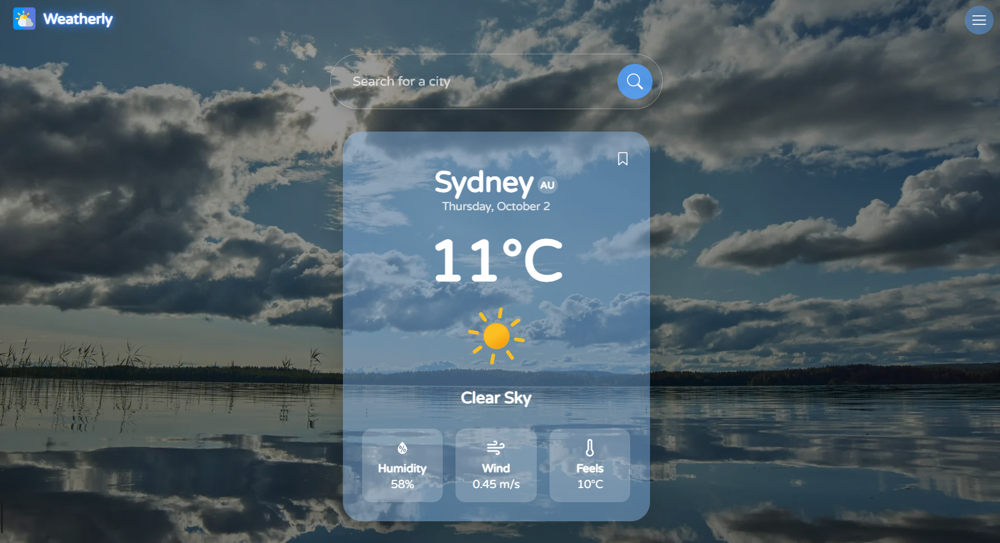

# Weatherly

A simple, responsive weather app built with **Next.js**, **React**, and **TailwindCSS**. It fetches real-time weather data from the **OpenWeatherMap API** and displays temperature and weather details in a clean, minimal card design.

---

## Features

- **City Search** – Search for any city worldwide + minimal suggestions
- **Real-Time Weather** – Shows temperature, weather condition, humidity, wind, and feels-like
- **Save Cities** - Bookmark cities for quick views
- **Modern UI** – Built with TailwindCSS, featuring smooth hover effects and rounded cards
- **Fast & Lightweight** – Powered by Next.js for optimal performance

---

## Tech Stack

- **Frontend:** [Next.js](https://nextjs.org/), [React](https://react.dev/)
- **Styling:** [TailwindCSS](https://tailwindcss.com/) + [React Hot Toast](https://react-hot-toast.com/)
- **Icons:** [React Icons](https://react-icons.github.io/react-icons/) + Cool [Meteocons](https://basmilius.github.io/weather-icons/) weather icons.
- **API:** [Axios](https://axios-http.com/docs/intro) promise API and [OpenWeatherMap API](https://openweathermap.org/api) to fetch weather data.

---

## Installation

1. Clone the repository and install dependencies:

```bash
git clone https://github.com/baraa-elhajj/Weatherly.git
cd weatherly
npm install
```

2. Create a `.env.local` file in the project root and add your OpenWeatherMap API key:

```bash
NEXT_PUBLIC_WEATHER_KEY=your_api_key_here
```

3. Run the app:

```bash
npm run dev
```

then go to http://localhost:3000

---

## Preview

### Main page



### Main + Saved pages


---

## Live Demo

Deployed on Vercel: <a href="https://weatherly-lb.vercel.app" target="_blank">weatherly-lb.vercel.app</a>

---

## Contribution

Feel free to fork this project or suggest improvements if you find something cool!
